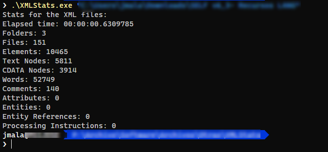

# XMLStats

Cycles through XML files and spits out stats about all of them, including the number of words in the text nodes.

I needed something like this to count the number of words in .xml files with language resources. Since I didn't find anything right of the bat, I programmed this simple command line app.

Usage:

```bash
xmlstats pathToFolder
```

It shows the progress with the files that is analyzing (it's only visible if there are thousands of files), and shows some useful numbers at the end:



It's supper fast analyzing thousands of .xml files (i.e: just 63ms analyzing the 151 files in the previous screenshot with more than 10 000 nodes). 

**Doesn't count words in comments.**

Works in Windows, Linux and Mac (untested).

The release files doesn't include the .NET 5 runtime, so you'll need the runtime installed for it to work.

